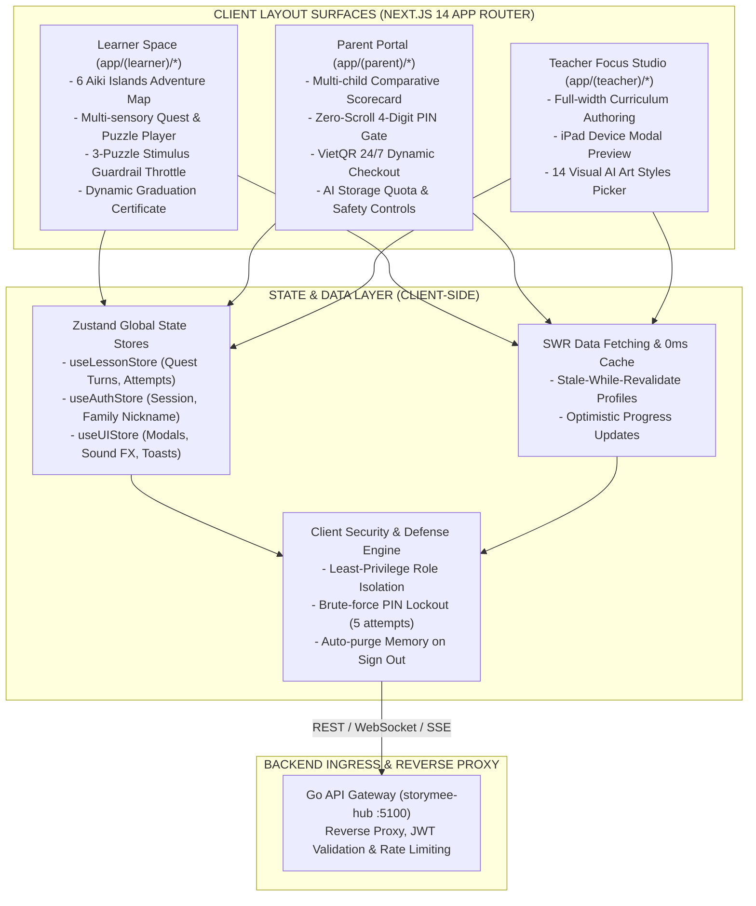
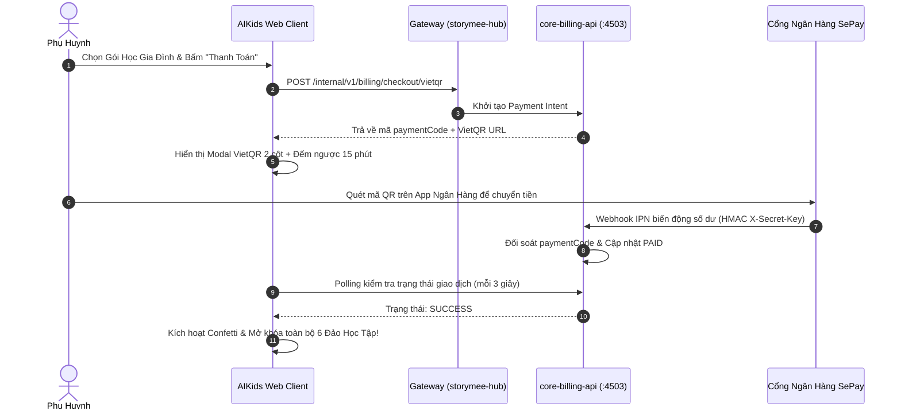

# 🌟 AIKids: Interactive Gamified E-Learning Platform (Frontend Client)

[](https://nextjs.org/)
[](https://react.dev/)
[](https://tailwindcss.com/)
[](https://www.typescriptlang.org/)
[](https://github.com/pmndrs/zustand)
[](https://swr.vercel.app/)
[](https://www.framer.com/motion/)

---

## 📖 I. Tổng Quan & Triết Lý Thiết Kế (Executive Summary)

**AIKids Web** là ứng dụng giao diện học tập tương tác nhập vai (*Gamified E-Learning Web Application*) được xây dựng chuyên biệt cho học sinh từ **9–15 tuổi**. Ứng dụng là sự kết hợp hoàn hảo giữa **kỹ thuật Frontend hiện đại** (Next.js 14 App Router, Zero-runtime overhead, Optimistic UI) và **nghiên cứu tâm lý thần kinh học tập** (*Child Cognitive Psychology*).

Khác biệt với các nền tảng học trực tuyến người lớn, AIKids áp dụng **Layout Defense Engine** bảo vệ học sinh khỏi kiệt quệ nhận thức (Cognitive Exhaustion), giao diện không nút cuộn gây xao nhãng (*Zero-Scroll Experience*), và rào chắn phụ huynh kiểm soát chi tiêu (*Parent Gate PIN Pad*).

---

## 🏗️ II. Kiến Trúc Phân Tầng Giao Diện (Frontend Architecture)



---

## 📂 III. Cấu Trúc Thư Mục Dự Án (Deep Component & Route Tree)

```
aikids-edtech-web/
├── package.json                         # Next.js 14 dependencies, Tailwind & Framer Motion
├── tsconfig.json                        # Strict TypeScript compilation rules
├── tailwind.config.js                   # Soft-Clay theme tokens & responsive breakpoints
├── apps/web/src/                        # Mã nguồn ứng dụng chính
│   ├── app/                             # Next.js 14 App Router Directory
│   │   ├── (learner)/                   # Vùng học tập học sinh (Gamified)
│   │   │   ├── page.tsx                 # Màn hình phiêu lưu chính & bản đồ đảo
│   │   │   ├── island/[id]/page.tsx     # Chi tiết đảo học tập & danh sách trạm
│   │   │   └── lesson/[id]/page.tsx     # Trình phát bài học & câu đố phản xạ
│   │   ├── (parent)/                    # Cổng quản trị phụ huynh (SaaS Clean)
│   │   │   ├── dashboard/page.tsx       # Bảng tiến độ đa chiều của con
│   │   │   ├── billing/page.tsx         # Quản lý gói học & lịch sử thanh toán
│   │   │   └── settings/page.tsx        # Cài đặt mã PIN & phân quyền tài khoản
│   │   └── (teacher)/                   # Cổng biên soạn giáo viên (Focus Studio)
│   │       └── editor/page.tsx          # Soạn thảo bài giảng & xem trước tablet
│   ├── components/                      # Thư viện UI Components dùng chung
│   │   ├── ui/                          # Atoms: Button, Modal, Card, Input, Badge
│   │   ├── layout/                      # Molecules: Header, FloatingNav, Sidebar
│   │   └── common/                      # Organisms: SoundPlayer, Confetti, Mascot
│   ├── features/                        # Bounded Context Modules
│   │   ├── parent-gate/                 # Zero-scroll PIN Pad & Google Recovery
│   │   ├── billing/                     # VietQR Checkout Modal, Counter & Polling
│   │   ├── lesson/                      # Station Runner & Stimulus Throttle
│   │   ├── creative/                    # 14 Visual AI Style Cards Picker
│   │   └── certificate/                 # Trình sinh chứng chỉ tốt nghiệp Canvas
│   ├── stores/                          # Zustand State Machines
│   │   ├── useLessonStore.ts            # Quản lý tiến độ trạm học, snapshot
│   │   └── useAuthStore.ts              # Quản lý JWT token và phiên học sinh
│   └── lib/                             # Tiện ích HTTP, SWR client, Audio FX
└── README.md                            # Cẩm nang kiến trúc giao diện
```

---

## 🛡️ IV. Cơ Chế Layout Defense Engine & Rào Chắn Tâm Lý (Guardrails)

### 1. Child Stimulus Throttle (Kiểm Soát Ngưỡng Kích Thích):
- Học sinh lứa tuổi 9-15 rất dễ gặp hiện tượng kiệt quệ nhận thức (*Cognitive Overload*) nếu giải đố liên tục.
- Ứng dụng giới hạn cứng **tối đa 3 câu đố liên tiếp/trạm**. Sau 3 câu, hệ thống bắt buộc kích hoạt chặng giãn cơ hoặc video hoạt hình thư giãn nhẹ trước khi bước tiếp.

### 2. Zero-Scroll Parent Gate (Bảo Vệ Ví Phụ Huynh):
- Khu vực thanh toán và quản trị tài khoản được bảo vệ bằng mã PIN 4 số độc lập.
- Modal bàn phím số được thiết kế vừa vặn 100% chiều cao màn hình di động (*Zero-Scroll*), ngăn chặn hoàn toàn việc chạm nhầm của trẻ em.
- Cơ chế tự khóa tạm thời 15 phút nếu nhập sai quá 5 lần liên tiếp (chống tấn công Brute-force đạt chuẩn OWASP A07).

### 3. Anti-AI Marker & Jargon Purging:
- Làm sạch hoàn toàn các thuật ngữ công nghệ phức tạp (*Diffusion, Checkpoints, LoRA, Prompts*).
- Thay thế bằng các khái niệm giáo dục trực quan: *Bút vẽ hoạt hình, Trợ lý kể chuyện, Họa sĩ sắc màu*.

---

## 💳 V. Quy Trình Thanh Toán Tự Động VietQR 24/7 (Payment Flow)



---

## 🎨 VI. Hệ Thống Thiết Kế Thân Thiện Trẻ Em (Soft-Clay Design System)

* **Bảng màu chủ đạo:**
  - `Aiki Blue` (#4A90E2): Kích thích tư duy logic và cảm giác an toàn.
  - `Sunbeam Yellow` (#F5A623): Năng lượng tích cực và sự hào hứng khám phá.
  - `Mint Green` (#7ED321): Ghi nhận thành công và giải thưởng hoàn thành.
* **Quy chuẩn tiếp cận (Accessibility WCAG 2.1 AA):**
  - Vùng chạm tối thiểu **48x48px** trên mọi nút bấm và thẻ bài.
  - Độ tương phản chữ/nền tối thiểu **4.5:1** bảo vệ thị lực học sinh.
  - Phản hồi đa giác quan: Âm thanh nhẹ nhàng (Click FX) kết hợp rung xúc giác (Haptic) trên thiết bị di động.

---

## ⚡ VII. Hướng Dẫn Cài Đặt & Chạy Thử Cục Bộ (Quickstart Runbook)

### 1. Cài đặt dependencies:
```bash
# Cài đặt trọn bộ packages
npm install
```

### 2. Cấu hình biến môi trường cục bộ:
Tạo file `.env.local` tại thư mục gốc:
```env
NEXT_PUBLIC_GATEWAY_URL=http://localhost:5100
NEXT_PUBLIC_APP_ENV=development
NEXT_PUBLIC_ENABLE_AUDIO_FX=true
```

### 3. Khởi chạy môi trường phát triển:
```bash
npm run dev
```
Mở trình duyệt tại: **`http://localhost:3000`**
