# 🎨 AI Kids Creator Academy — Portfolio Showcase

> **Nền tảng E-Learning Sáng Tạo & Toán Tư Duy AI cho trẻ em 9–15 tuổi**  
> Kết hợp công nghệ AI Tạo sinh an toàn (Safe AI Creation) và phương pháp sư phạm trực quan Montessori (Hallmark Craft / Soft Clay Design System).

[](https://react.dev/)
[](https://www.typescriptlang.org/)
[](https://vitejs.dev/)
[](https://tailwindcss.com/)
[](https://vitest.dev/)
[](https://app.aikid.vn)

---

## 🌟 Trải Nghiệm Thực Tế (Live Demo on Production)

🔗 **Website chính thức:** [https://app.aikid.vn](https://app.aikid.vn)  
Hệ thống đã triển khai production hoàn chỉnh trên Vercel Edge và kết nối trực tiếp với cụm Microservices Gateway (`dev-hub.storymee.com`).

### 🔑 Danh sách Tài khoản Test (Dành cho Nhà tuyển dụng & Người xem Portfolio)

Dưới đây là bộ tài khoản đã được khởi tạo và phân quyền sẵn trên hệ thống production để người xem có thể đăng nhập và trải nghiệm thực tế từng vai trò:

| Phân hệ / Vai trò | Email đăng nhập | Mật khẩu | Phạm vi trải nghiệm & Tính năng nổi bật |
| :--- | :--- | :--- | :--- |
| 👑 **Quản trị viên (Admin)** | `demo.admin@aikid.vn` | `AikidDemo@2026` | Toàn quyền Dashboard Quản trị (`/admin`): Giám sát hệ thống, Phân quyền RBAC đa cấp, Quản trị người dùng & nhân sự, Ngân hàng đề thi Olympic ASMO, AI Model Routing & định mức chi phí, Quản lý tài chính & đối soát giao dịch VietQR SePay. |
| 👩‍🏫 **Giáo viên (Teacher)** | `demo.teacher@aikid.vn` | `AikidDemo@2026` | Cổng Giáo viên (`/teacher`): Quản lý lớp học, theo dõi sĩ số & tiến độ học viên, bảng thống kê học lực theo thời gian thực, nhận xét đánh giá từng bài làm, quản trị giáo trình & bài tập. |
| 👨‍👩‍👧 **Phụ huynh (Parent)** | `demo.parent@aikid.vn` | `AikidDemo@2026` | Cổng Phụ huynh (`/parent`): Quản lý hồ sơ gia đình (Bé Bi 9 tuổi & Bé Bo 12 tuổi), Báo cáo biểu đồ Radar kỹ năng, kiểm soát thời lượng học, duyệt các tác phẩm sáng tạo của con, nâng cấp gói học gia đình, bảo vệ phiên qua Parent Gate. |
| 🎒 **Học sinh (Student / Learner)** | *(Vào từ Cổng Phụ huynh)*<br>hoặc dùng **[Link Demo Trực Tiếp](https://app.aikid.vn/demo)** | *(Không cần mật khẩu)* | Bản đồ Đảo học tập (`/home`, `/world`), Đấu trường Olympic Toán ASMO KaTeX (`/asmo`), Xưởng vẽ tranh & sáng tác tranh tự do (`/creative`), Ba lô vật phẩm & Tủ huy hiệu thành tích (`/backpack`, `/achievements`), Mèo AIKI tương tác giọng nói. |

> 🛡️ **Kiến trúc Bảo mật Đặc biệt cho Học sinh (COPPA & Montessori Compliance):**  
> Tuân thủ các nguyên tắc bảo vệ quyền riêng tư trẻ em trực tuyến (COPPA) và triết lý đồng hành của cha mẹ, hệ thống **không cấp mật khẩu/PIN độc lập cho trẻ em**. Trẻ chỉ bước vào thế giới học tập khi phụ huynh đã đăng nhập và kích hoạt chọn hồ sơ con qua cơ chế **Parent-to-Child Session Handoff** an toàn, hoặc thông qua Sandbox Demo cách ly.

---

## 🎯 Mục Đích & Triết Lý Dự Án

**AI Kids Creator Academy** được thiết kế nhằm giải quyết bài toán: *Làm thế nào để trẻ em 9–15 tuổi tiếp cận trí tuệ nhân tạo một cách tích cực, sáng tạo và lành mạnh, thay vì thụ động tiêu thụ nội dung hoặc bị phụ thuộc vào máy móc?*

1. **Sư phạm Trực quan Montessori:**  
   Mỗi bài học được cấu trúc thành các "Trạm học" (Stations) theo lộ trình từng bước: *Quan sát → Thử nghiệm → Đúc kết → Sáng tạo tự do*.
2. **Safe AI Creation (AI Sáng Tạo An Toàn):**  
   Trẻ được học cách điều khiển AI thông qua Prompt Engineering trực quan bằng thẻ bài, vẽ nét phác thảo để AI hoàn thiện tranh, và viết kịch bản truyện tranh với ngôn từ trong sáng.
3. **Đấu Trường Olympic Toán ASMO & KaTeX:**  
   Tích hợp ngân hàng hàng nghìn câu hỏi thi Olympic Toán quốc tế ASMO với bộ render công thức toán KaTeX chuẩn mực, bài toán hình học trực quan và mô phỏng 3D giúp trẻ rèn luyện tư duy logic đỉnh cao.
4. **Anti-AI-Slop & Human-Craft Icon Policy (Bắt Buộc):**  
   - Tuyệt đối nói **KHÔNG** với các icon AI sáo rỗng: không dùng hình robot kim loại, không dùng icon vi mạch/máy móc (`Bot`, `Cpu`, `CircuitBoard`).
   - Giao diện sử dụng phong cách **2D Flat Soft Clay** với bảng màu Pastel ấm áp, thân thiện với mắt trẻ em.
   - Nhân vật đồng hành duy nhất là **Mèo AIKI** — linh vật hoạt hình vẽ tay mang tính nhân văn và ấm áp.

---

## 📸 Hình Ảnh Thực Tế Từng Phân Hệ (Visual Gallery)

Toàn bộ hình ảnh dưới đây được chụp trực tiếp từ môi trường Production [app.aikid.vn](https://app.aikid.vn):

### 1. Cổng Chào Đón & Đăng Nhập An Toàn (Welcome & Auth Portal)
Giao diện đăng nhập thân thiện, hỗ trợ xác thực tài khoản phụ huynh với linh vật Mèo AIKI chào đón.
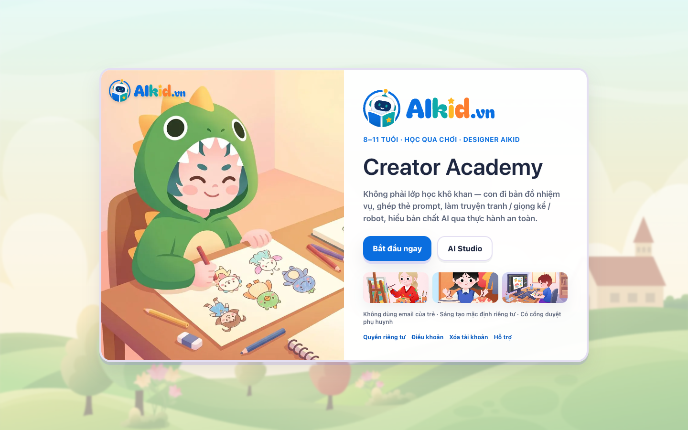

---

### 2. Không Gian Học Sinh: Bản Đồ Đảo & Trạm Khám Phá (Learner World & Stations)
Học sinh phiêu lưu qua các Đảo học tập theo lộ trình mở khóa từng cấp độ:
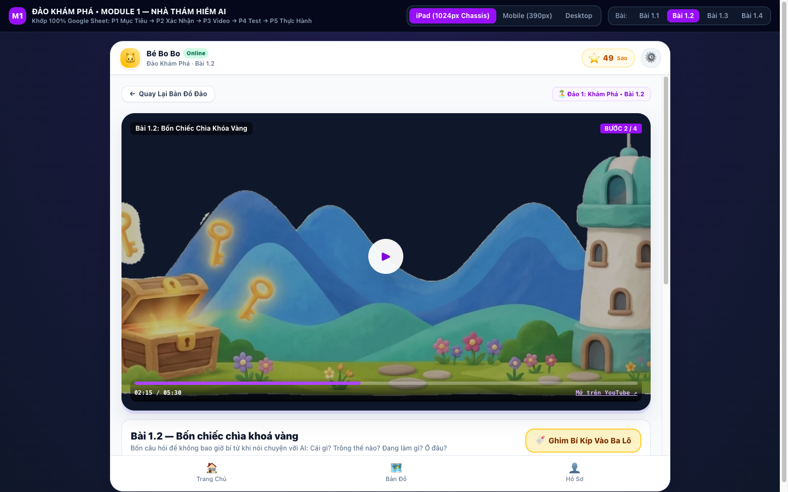

---

### 3. Dashboard Học Sinh & Xưởng Sáng Tạo Tự Do (Student Dashboard & Creative Canvas)
Bảng điều khiển cá nhân hóa với cấp độ, số sao tích lũy, ba lô vật phẩm và công cụ vẽ tranh tương tác:
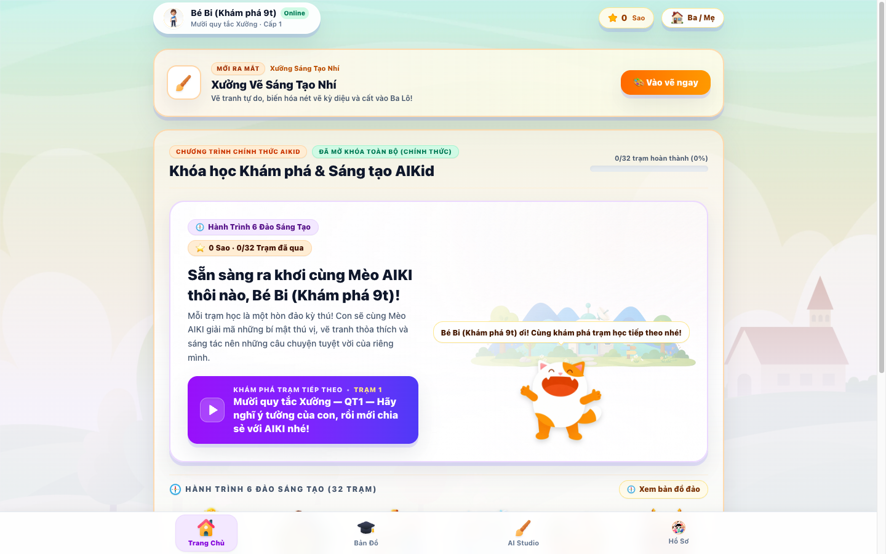
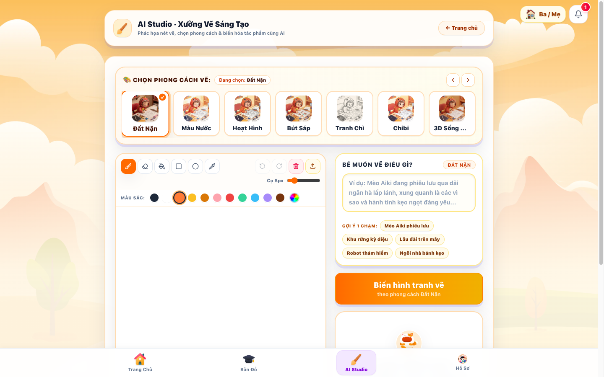

---

### 4. Đấu Trường Toán Olympic ASMO & Mô Phỏng Trực Quan (ASMO Math Arena)
Hệ thống giải toán tư duy quốc tế với công thức KaTeX, hình vẽ hình học sinh động:
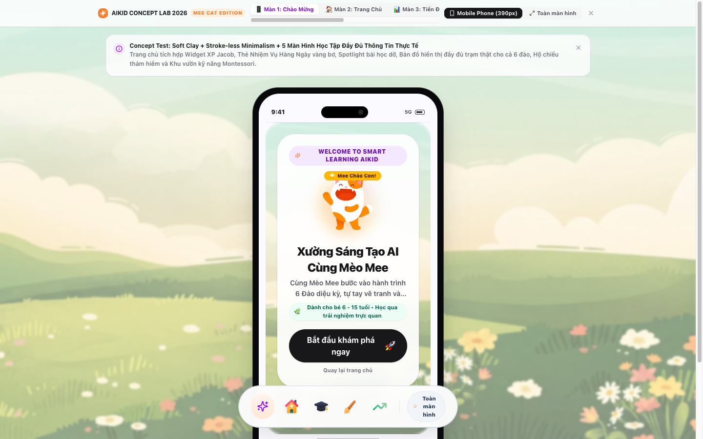

---

### 5. Cổng Phụ Huynh: Quản Trị Gia Đình & Báo Cáo Học Tập (Parent Portal & Analytics)
Phụ huynh quản lý hồ sơ các con, giám sát thời lượng học tập và biểu đồ radar kỹ năng chi tiết:
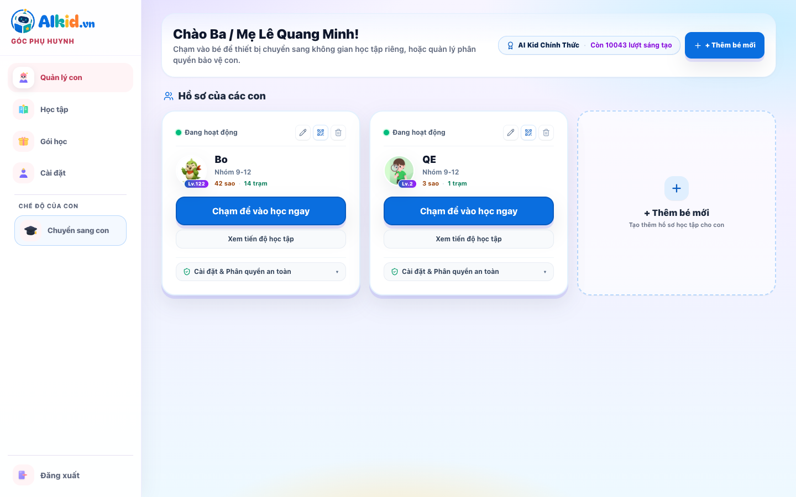
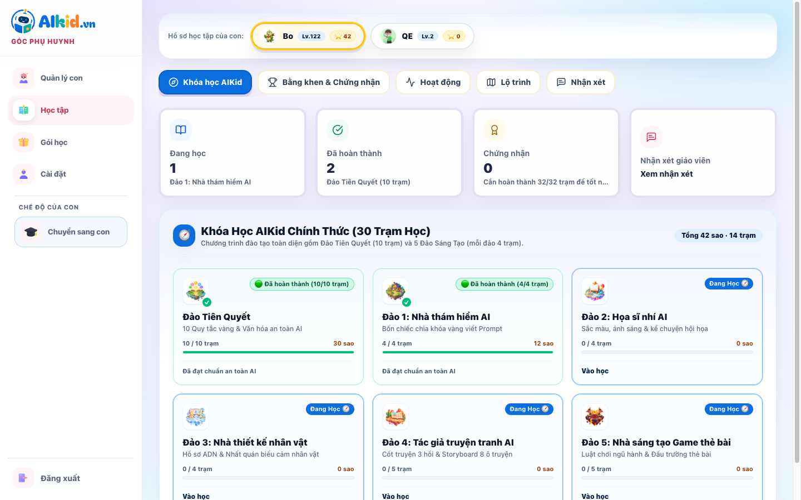

---

### 6. Cổng Giáo Viên: Quản Lý Lớp Học & Giáo Trình (Teacher Studio & Curriculum)
Giáo viên theo dõi tiến độ từng học sinh, quản trị bài giảng và thống kê mức độ hoàn thành nhiệm vụ:
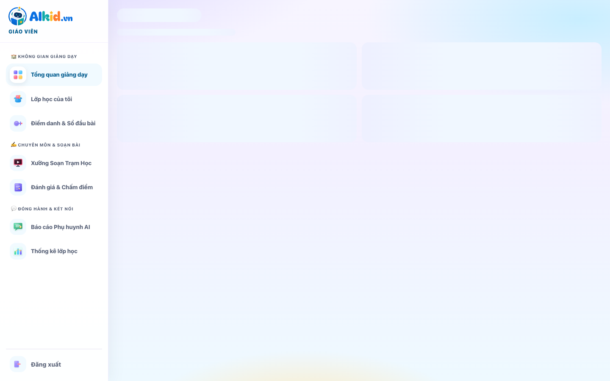
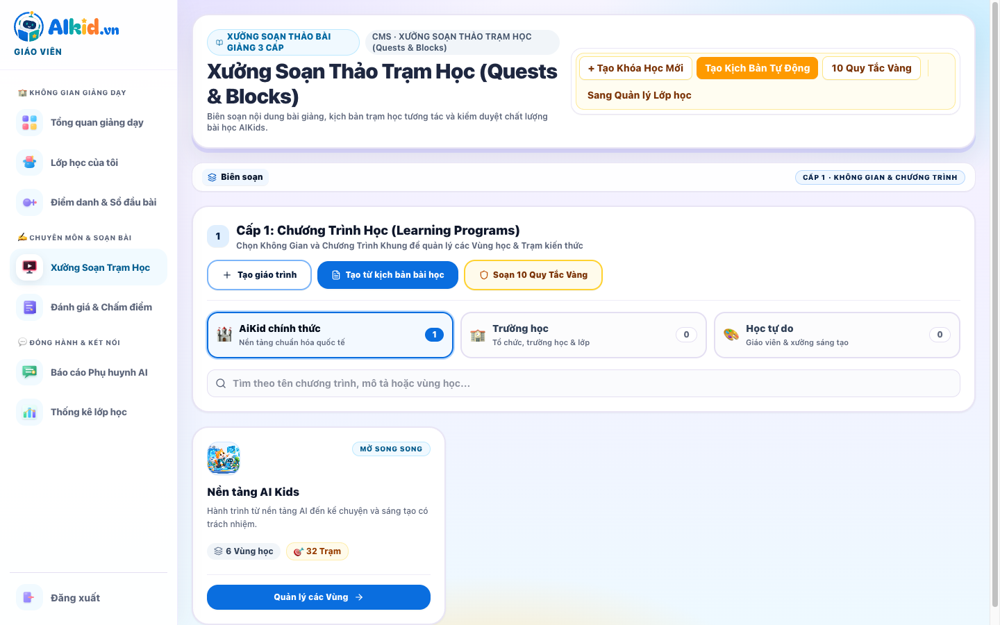

---

### 7. Bảng Điều Hành Quản Trị Viên (Admin Console & Financial Overview)
Admin giám sát toàn bộ hệ thống, phân quyền RBAC, quản trị người dùng và doanh thu thanh toán VietQR SePay:
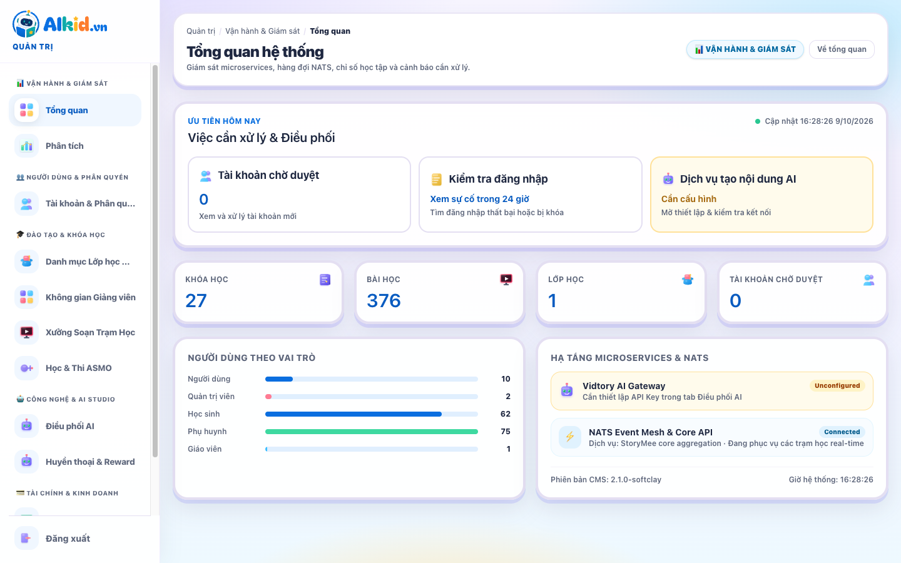
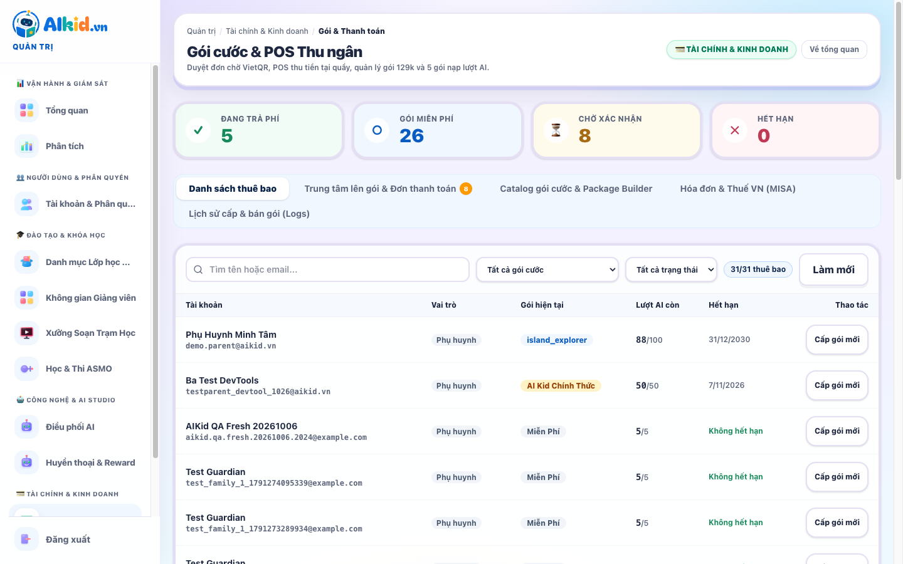

---

### 8. Cơ Chế Chuyển Phiên An Toàn Parent Gate (Child Profile Selector)
Bộ chọn hồ sơ con chuẩn Hallmark UI với khả năng cách ly dữ liệu học tập tuyệt đối giữa các bé trong cùng gia đình:
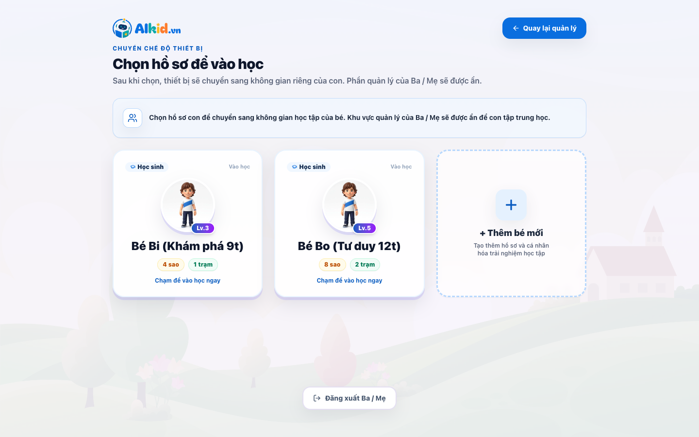

---

## 🏗️ Kiến Trúc Kỹ Thuật (Architecture & Tech Stack)

Hệ thống được xây dựng theo mô hình **Decoupled Modern Frontend** kết nối cụm **Microservices Mesh** thông qua API Gateway bảo mật:

```text
┌────────────────────────────────────────────────────────────────────────┐
│               AI Kids Web App (React 19 + TypeScript + Vite)           │
│                      https://app.aikid.vn (Vercel)                     │
└───────────────────────────────────┬────────────────────────────────────┘
                                    │ Proxied HTTPS requests
                                    ▼
┌────────────────────────────────────────────────────────────────────────┐
│           StoryMee Gateway Hub (:5100, Golang / Gin Engine)            │
│         - Xác thực Session Cookie (__Host-storymee_session)            │
│         - Xóa sạch client identity headers giả mạo                     │
│         - Tiêm định danh chuẩn: X-User-Id, X-Actor, X-Child-Profile-Id │
└───────┬──────────────┬──────────────┬──────────────┬───────────────────┘
        │              │              │              │
        ▼              ▼              ▼              ▼
┌──────────────┐┌──────────────┐┌──────────────┐┌────────────────────────┐
│ Core Account ││   Core LMS   ││Core Gamificat││     Core Billing       │
│    (:4502)   ││    (:4509)   ││   (:4513)    ││        (:4507)         │
│  Gia đình &  ││ Tiến độ trạm,││ Sao, XP, Cấp ││   Gói cước, QR SePay,  │
│  Hồ sơ con   ││ Đề thi ASMO  ││  Huy hiệu    ││     Đối soát tự động   │
└───────┬──────┘└──────┬───────┘└──────┬───────┘└───────────┬────────────┘
        │              │               │                    │
        └──────────────┴───────┬───────┴────────────────────┘
                               ▼
            ┌──────────────────────────────────────┐
            │   PostgreSQL Write SSOT (Supabase)   │
            │      Prisma ORM · NATS JetStream     │
            │    Cloudflare R2 Media Object Storage│
            └──────────────────────────────────────┘
```

### Điểm nhấn Kỹ thuật Nổi bật:
- **Zero Raw JWT in JS:** Token không bao giờ được lưu trong `localStorage` hay biến JS toàn cục. Toàn bộ session được quản lý qua `HttpOnly`, `SameSite=Lax`, `Secure` Cookie để chống triệt để các cuộc tấn công XSS/Token Stealing.
- **Micro-Frontend Modular Boundaries:** Mỗi phân hệ (`features/home`, `features/parent`, `features/teacher`, `features/admin`, `features/asmo`) hoạt động độc lập với State Management riêng (Zustand) và lazy load theo Route.
- **Idempotency & Resilience:** Mọi thao tác ghi nhạy cảm (hoàn thành bài học, mở trạm, tạo đơn hàng POS) đều bắt buộc gửi kèm `Idempotency-Key` để ngăn chặn double-submit trên mạng yếu.
- **High Performance & Compression:** Toàn bộ bundle và tài nguyên được cấu hình ngân sách hiệu năng nghiêm ngặt (Perf Budget), hỗ trợ pre-compression Brotli/Gzip và định dạng ảnh WebP tối ưu.

---

## 📁 Cấu Trúc Thư Mục Dự Án (Repository Structure)

```text
aikids-edtech-web/
├── apps/
│   ├── web/                         # Production React 19 Single Page App
│   │   ├── src/
│   │   │   ├── app/                 # Routing, Guards, App Lifecycle
│   │   │   │   ├── routing/         # Role-based route definitions
│   │   │   │   │   ├── student-routes.tsx
│   │   │   │   │   ├── family-routes.tsx
│   │   │   │   │   ├── teacher-routes.tsx
│   │   │   │   │   └── admin-routes.tsx
│   │   │   ├── features/            # Feature-driven modules
│   │   │   │   ├── admin/           # Phân hệ Quản trị viên (RBAC, AI, Billing)
│   │   │   │   ├── asmo/            # Phân hệ Toán Olympic ASMO & KaTeX
│   │   │   │   ├── auth/            # Đăng nhập, đăng ký, Parent Gate
│   │   │   │   ├── backpack/        # Ba lô đồ dùng học tập của bé
│   │   │   │   ├── creative/        # Xưởng vẽ & sáng tạo nội dung AI
│   │   │   │   ├── home/            # Dashboard học sinh & Trạm học
│   │   │   │   ├── lesson/          # Trình phát bài giảng tương tác
│   │   │   │   ├── parent/          # Cổng phụ huynh & Phân tích tiến độ
│   │   │   │   ├── rewards/         # Kho phần thưởng, huy hiệu, sao
│   │   │   │   ├── teacher/         # Cổng giáo viên & Quản lý lớp học
│   │   │   │   └── world/           # Bản đồ đảo học tập phiêu lưu
│   │   │   └── shared/              # Thư viện dùng chung
│   │   │       ├── components/ui/   # Soft Clay UI Component System
│   │   │       ├── lib/             # API client, normalizers, RBAC logic
│   │   │       └── store/           # Zustand global stores (auth, learner)
│   │   └── scripts/                 # Performance audits, curriculum tooling
├── docs/
│   ├── screenshots/                 # Toàn bộ ảnh chụp thực tế production
│   ├── CURRICULUM_3_REGIONS_VI.md   # Khung chương trình giáo dục
│   └── DATA_OWNERSHIP_AND_OFFLINE_SYNC.md # Hợp đồng dữ liệu & đồng bộ
├── vercel.json                      # Cấu hình Vercel Production & API Proxy
└── package.json                     # Workspace configurations
```

---

## 🛠️ Hướng Dẫn Cài Đặt & Chạy Thử Nghiệm

### Yêu Cầu Môi Trường:
- **Node.js**: Phiên bản 20.x hoặc 22.x LTS
- **Trình quản lý gói**: `npm`

### Các Bước Thực Hiện:

```bash
# 1. Clone repository
git clone https://github.com/zuzziQ/aikids-edtech-web.git
cd aikids-edtech-web

# 2. Cài đặt dependencies sạch
npm ci

# 3. Chạy môi trường phát triển (Mặc định proxy API trực tiếp về dev-hub.storymee.com)
npm run dev
# Mở trình duyệt tại: http://localhost:5173

# 4. Kiểm tra Type-safe nghiêm ngặt
npm run typecheck

# 5. Chạy toàn bộ 1604 bài kiểm thử tự động
npm test -- --run

# 6. Build gói sản phẩm tối ưu cho Production
npm run build
```

---

## 👨‍💻 Tác Giả & Portfolio

- **Họ và tên:** Lê Quang Minh
- **GitHub:** [@zuzziQ](https://github.com/zuzziQ)
- **Email:** `zuzzivn@gmail.com`
- **Dự án Production:** [https://app.aikid.vn](https://app.aikid.vn)

---
*Bản quyền © 2026 AI Kids Creator Academy & StoryMee Ecosystem. Mọi quyền được bảo lưu.*
