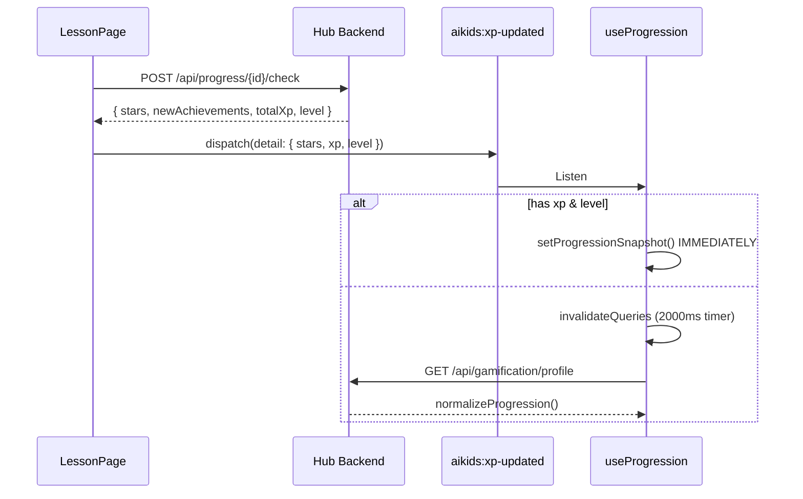

# AI Kids — Data Flow

## API Proxy & Cookie
- Browser gọi `/api/*` → Proxy (Vite/Vercel) → `dev-hub.storymee.com`.
- Tuyệt đối không gọi trực tiếp domain backend từ browser để đảm bảo cookie HttpOnly (phiên học) hoạt động đúng đắn.

## XP / Level / Achievement Pipeline



## Progress Saving (Mid-lesson)
Khi lưu quá trình học (progress stage), hệ thống sẽ check `isLocalId` để chặn gọi API vô ích với các curriculum ảo:
```ts
const isLocalId = progressId.startsWith('rule-') 
               || progressId.startsWith('bai-') 
               || progressId === 'aiki-rules'
```
Nếu `isLocalId` là true, sẽ bỏ qua việc gọi `PUT /api/resume` cho stage đó.

## Station Navigation
Các thành phần như LeaderboardPage sử dụng chung dữ liệu từ `useProgression` thay vì dựa vào cache cá nhân (VD: không dùng `celebration.personal.xp/level`) để đồng nhất state.
